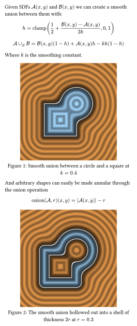

# Eikonal


Create 2D visualisations of Signed Distance Functions (SDFs) entirely in Typst!

Can both be used inline in your documents or exported directly to png, svg or pdf (Just like all Typst documents).

Due to the entire rendering being done in the single Typst process, large resolutions can take a while. But due to the incremental compilation of Typst, you can still get a preview of your work after the image has been rendered once.

All basic shapes are derived from the great Inigo Quilez's work on SDFs. You can find his work here: https://iquilezles.org/articles/distfunctions/ . I have also adapted his color palettes as one of the palletes in Eikonal.

## Example

```typst
#import "eikonal.typ": *
#set page(width:10cm, height:auto, margin: 10pt)

#let scene = op-smooth-union(
  op-translate(sd-circle(r: 1.0), dx: 0.5, dy:0.5),
  op-translate(sd-box(), dx: -0.5, dy: -0.5),
  k: 0.4
)

Given SDFs $cal(A)(x,y)$ and $cal(B)(x,y)$ we can create a smooth union between them with:

$ h = "clamp"(1/2 + (cal(B)(x,y) - cal(A)(x,y))/(2 k), 0, 1) $
$ cal(A) union_S cal(B) = cal(B)(x,y) (1 - h) + cal(A)(x,y) h - k h (1 - h) $

Where $k$ is the smoothing constant. 
#figure(
  sdf-image(scene, res: 200, bounds: (-3,-3,3,3), palette: iq-palette(band: 20, line:0.04)),
  caption: [Smooth union between a circle and a square at $k=0.4$]
)
Furthermore, arbitrary shapes can easily be made annular through the onion operation

$ "onion"(cal(A), r)(x,y) = abs(cal(A)(x,y)) - r $

#figure(
  sdf-image(op-onion(scene, 0.3), res: 200, bounds: (-3, -3, 3, 3), palette: iq-palette(
    band: 20,
    line: 0.04,
  )),
  caption: [The smooth union hollowed out into a shell of thickness $2r$ at $r=0.3$],
)
```

<p align="center">
  
</p>